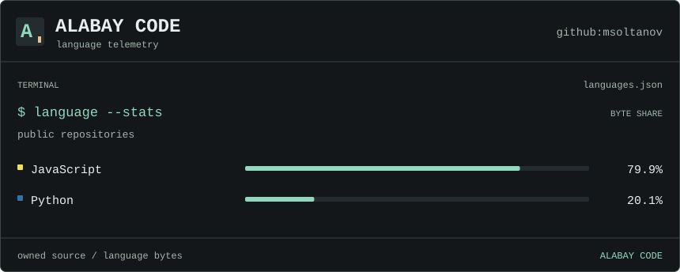
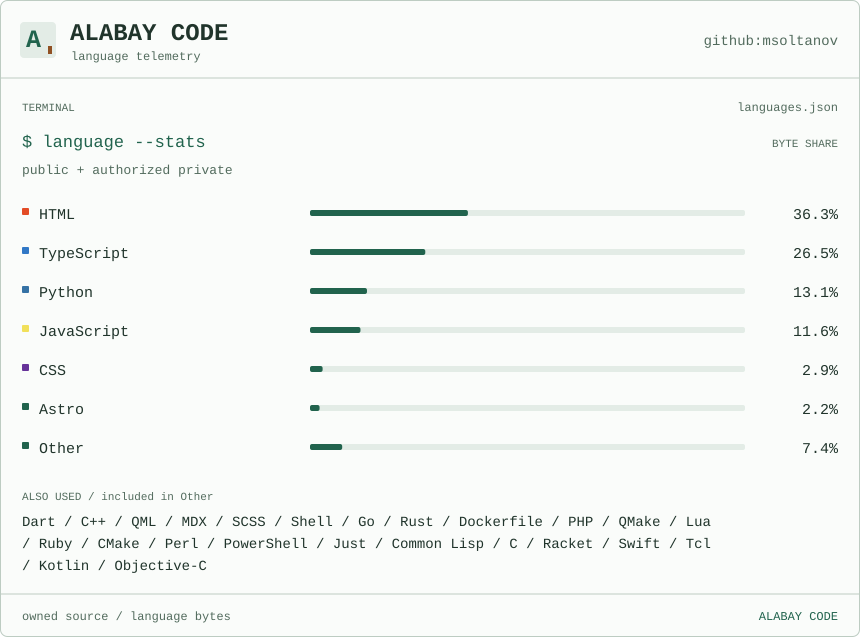

<a href="assets/profile-dark.svg#gh-dark-mode-only">
  <picture>
    <source media="(prefers-reduced-motion: reduce) and (max-width: 600px)" srcset="assets/profile-dark-mobile-still.svg">
    <source media="(prefers-reduced-motion: reduce)" srcset="assets/profile-dark-still.svg">
    <source media="(max-width: 600px)" srcset="assets/profile-dark-mobile.svg">
    
  </picture>
</a>
<a href="assets/profile-light.svg#gh-light-mode-only">
  <picture>
    <source media="(prefers-reduced-motion: reduce) and (max-width: 600px)" srcset="assets/profile-light-mobile-still.svg">
    <source media="(prefers-reduced-motion: reduce)" srcset="assets/profile-light-still.svg">
    <source media="(max-width: 600px)" srcset="assets/profile-light-mobile.svg">
    
  </picture>
</a>

### Tech stack

  <a href="https://www.python.org/" title="Python"><picture>
    <source media="(prefers-color-scheme: dark)" srcset="https://skillicons.dev/icons?i=python&amp;theme=dark">
    
  </picture></a>
  <a href="https://www.typescriptlang.org/" title="TypeScript"><picture>
    <source media="(prefers-color-scheme: dark)" srcset="https://skillicons.dev/icons?i=typescript&amp;theme=dark">
    
  </picture></a>
  <a href="https://go.dev/" title="Go"><picture>
    <source media="(prefers-color-scheme: dark)" srcset="https://skillicons.dev/icons?i=go&amp;theme=dark">
    
  </picture></a>
  <a href="https://www.rust-lang.org/" title="Rust"><picture>
    <source media="(prefers-color-scheme: dark)" srcset="https://skillicons.dev/icons?i=rust&amp;theme=dark">
    
  </picture></a>
  <a href="https://elixir-lang.org/" title="Elixir"><picture>
    <source media="(prefers-color-scheme: dark)" srcset="https://skillicons.dev/icons?i=elixir&amp;theme=dark">
    
  </picture></a>
  <a href="https://kotlinlang.org/" title="Kotlin"><picture>
    <source media="(prefers-color-scheme: dark)" srcset="https://skillicons.dev/icons?i=kotlin&amp;theme=dark">
    
  </picture></a>
  <a href="https://flutter.dev/" title="Flutter"><picture>
    <source media="(prefers-color-scheme: dark)" srcset="https://skillicons.dev/icons?i=flutter&amp;theme=dark">
    
  </picture></a>
  <a href="https://dart.dev/" title="Dart"><picture>
    <source media="(prefers-color-scheme: dark)" srcset="https://skillicons.dev/icons?i=dart&amp;theme=dark">
    
  </picture></a>
  <a href="https://developer.mozilla.org/en-US/docs/Web/HTML" title="HTML"><picture>
    <source media="(prefers-color-scheme: dark)" srcset="https://skillicons.dev/icons?i=html&amp;theme=dark">
    
  </picture></a>
  <a href="https://developer.mozilla.org/en-US/docs/Web/CSS" title="CSS"><picture>
    <source media="(prefers-color-scheme: dark)" srcset="https://skillicons.dev/icons?i=css&amp;theme=dark">
    
  </picture></a>
  <a href="https://www.microsoft.com/windows/windows-11" title="Windows 11"><picture>
    <source media="(prefers-color-scheme: dark)" srcset="https://skillicons.dev/icons?i=windows&amp;theme=dark">
    
  </picture></a>
  <a href="https://www.kernel.org/" title="Linux"><picture>
    <source media="(prefers-color-scheme: dark)" srcset="https://skillicons.dev/icons?i=linux&amp;theme=dark">
    
  </picture></a>
  <a href="https://code.visualstudio.com/" title="VS Code"><picture>
    <source media="(prefers-color-scheme: dark)" srcset="https://skillicons.dev/icons?i=vscode&amp;theme=dark">
    
  </picture></a>

<a href="assets/languages-dark.svg#gh-dark-mode-only">
  <picture>
    <source media="(prefers-reduced-motion: reduce) and (max-width: 600px)" srcset="assets/languages-dark-mobile-still.svg">
    <source media="(prefers-reduced-motion: reduce)" srcset="assets/languages-dark-still.svg">
    <source media="(max-width: 600px)" srcset="assets/languages-dark-mobile.svg">
    
  </picture>
</a>
<a href="assets/languages-light.svg#gh-light-mode-only">
  <picture>
    <source media="(prefers-reduced-motion: reduce) and (max-width: 600px)" srcset="assets/languages-light-mobile-still.svg">
    <source media="(prefers-reduced-motion: reduce)" srcset="assets/languages-light-still.svg">
    <source media="(max-width: 600px)" srcset="assets/languages-light-mobile.svg">
    
  </picture>
</a>

[pdf-shrinker](https://github.com/msoltanov/pdf-shrinker) · [Unstar](https://github.com/msoltanov/Unstar) · [Proxmox writing skill](https://github.com/msoltanov/Proxmox-Technical-Writing-Style-Skill)

[mknsltnw@gmail.com](mailto:mknsltnw@gmail.com) · [me@msoltanov.com](mailto:me@msoltanov.com) · [X](https://x.com/0xsolt) · [LinkedIn](https://tr.linkedin.com/in/mekan-soltanov-31986097) · [HN](https://news.ycombinator.com/user?id=soltanov)
