<a href="assets/profile-dark.svg#gh-dark-mode-only">
  <picture>
    <source media="(max-width: 600px)" srcset="assets/profile-dark-mobile.svg">
    
  </picture>
</a>
<a href="assets/profile-light.svg#gh-light-mode-only">
  <picture>
    <source media="(max-width: 600px)" srcset="assets/profile-light-mobile.svg">
    
  </picture>
</a>

<a href="assets/languages-dark.svg#gh-dark-mode-only">
  <picture>
    <source media="(max-width: 600px)" srcset="assets/languages-dark-mobile.svg">
    
  </picture>
</a>
<a href="assets/languages-light.svg#gh-light-mode-only">
  <picture>
    <source media="(max-width: 600px)" srcset="assets/languages-light-mobile.svg">
    
  </picture>
</a>

[pdf-shrinker](https://github.com/msoltanov/pdf-shrinker) · [Unstar](https://github.com/msoltanov/Unstar) · [Proxmox writing skill](https://github.com/msoltanov/Proxmox-Technical-Writing-Style-Skill)
